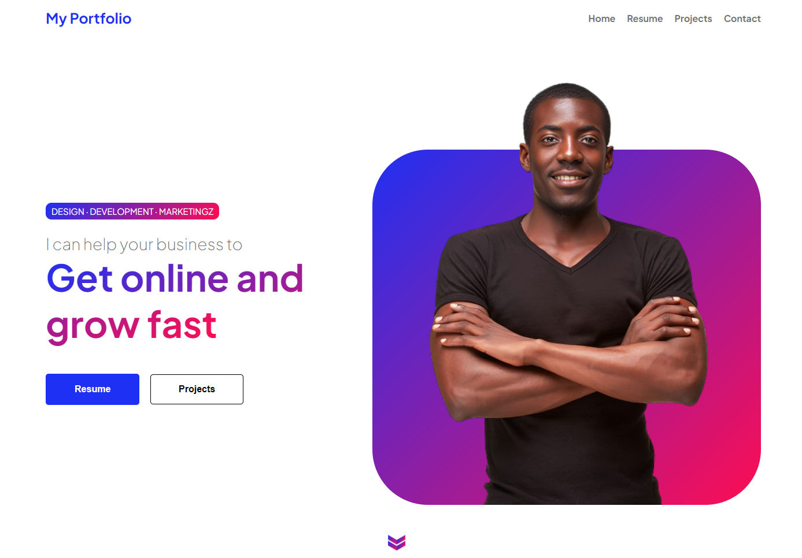

# DevOpsDays

## Description
This is an elegant and responsive portfolio template, developed with HTML, CSS and JavaScript. Highlight your skills, experience and projects in an attractive way. Includes intuitive navigation, organized sections, and interactive details to showcase your work in an impactful way. Make your portfolio stand out with this modern and easy-to-use template!

## Used technology
- HTML
- CSS
- JavaScript

## Main Features
- **Responsive Design**
- **Customizable Sections**
- **Integration with Development Platforms**
- **Animations and Visual Effects**

## Screenshots

## How to use
1. Clone the repository to your local machine.
2. Open the `index.html` file in your web browser.

## Contribution
We appreciate contributions! If you want to collaborate in the development of DevOpsDays, follow these steps:
1. Create a fork of the repository.
2. Clone your fork to your local machine.
3. Create a new branch for your feature or fix.
4. Make the necessary changes and confirm your modifications.
5. Upload the branch to your fork on GitHub.
6. Open a pull request to this master repository.

## Authors
- [Brayan Garzón - DevDynasty](https://github.com/BrayanGarzon) - Lead Developer

## Contact
If you have any questions or suggestions, please feel free to contact us at [Brayan.Garzon.Dev@gmail.com].

